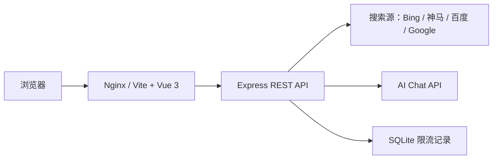

# 百分之一帖子生成器

面向 TapTap《我的百分之一》活动的轻量 AI 推荐帖生成工具。


[快速开始](#快速开始) · [项目特性](#项目特性) · [功能范围](#功能范围) · [技术架构](#技术架构) · [API](#api) · [免责声明](#免责声明)

## 项目简介

`百分之一帖子生成器` 是一个输入游戏名即可生成 TapTap《我的百分之一》活动格式推荐帖的 Web 工具。它会根据用户输入的游戏名称搜索公开资料，并结合玩家手动补充的信息生成一篇结构完整、方便复制发布的帖子。

项目强调“用户输入优先”。最终文章中的“游戏名称”始终使用玩家输入值，不交给 AI 改写；可选字段也会尽量保留用户原始表达，让 AI 主要负责资料整理、语气润色和活动格式组织。

前端提供表单、搜索状态、生成结果、主题配色、使用限制提示和一键复制；后端负责联网搜索、AI 调用、提示词组装和基于 SQLite 的基础限流。

## 项目特性

| 能力 | 说明 |
| --- | --- |
| 活动格式生成 | 生成 TapTap《我的百分之一》活动格式帖子 |
| 游戏名固定 | 最终文章中的游戏名称直接使用玩家输入值 |
| 联网搜索 | 自动搜索公开资料，支持成功、失败、超时和无结果状态展示 |
| 手动补充 | 支持发售平台、游玩时间、推荐人群、个人故事、许愿卡牌 |
| 结果复制 | 一键复制完整生成结果 |
| 主题系统 | 支持亮色 / 暗色模式和多套主题配色 |
| 使用限制提示 | 页面底部展示版本、使用限制、GitHub 仓库和 GPL 协议 |
| Docker 部署 | 支持 Docker Compose 一键部署 |

## 功能范围

- 输入游戏名并生成活动推荐帖。
- 根据公开资料生成游戏背景和推荐理由。
- 展示可展开的搜索状态区。
- 根据后端 env 限流配置展示“使用限制”悬浮说明。
- 在没有配置 AI Key 时使用 mock 内容，方便本地调试。
- 支持桌面端和移动端浏览器。

当前不包含用户登录、后台管理、API Key 在线管理、模型在线切换、多人协作编辑或帖子发布自动化。本项目只负责生成和复制文本，不会代替用户发布内容。

## 免责声明

本项目仅用于软件开发、AI 工具研究与技术交流学习，主要用于探索 Web 应用开发、AI 内容生成、搜索服务整合、Docker 部署和开源项目维护流程。

本项目页面、提示词和生成内容可能涉及已上线游戏《百分之一》及 TapTap 活动相关信息。本项目不是《百分之一》官方产品，不代表游戏开发方、发行方或 TapTap 平台立场，也不提供任何商业化服务。

项目运行过程中获取或整理的公开资料仅用于学习、测试和内容生成演示。不得将本项目用于违规获取游戏资源、绕过平台或游戏规则、违规参与游戏活动、刷取奖励、伪造内容或其他可能损害游戏方、平台方及其他用户权益的行为。

使用者应遵守相关游戏、平台活动规则、版权、商标和社区规范。生成内容仅供参考，发布前请自行核对事实，并自行承担使用与发布责任。

## 快速开始

### 部署用户

推荐使用 Docker Compose：

```bash
git clone git@github.com:littleseven2003/onepercent_taptap_generator.git
cd onepercent_taptap_generator
cp .env.example .env
docker compose up -d --build
```

部署后访问：

```text
http://服务器IP:8080
```

当前发布版本：`v1.0.0`。

### 开发者

安装后端依赖：

```bash
cd server
npm install
```

安装前端依赖：

```bash
cd web
npm install
```

启动后端：

```bash
cd server
npm run dev
```

启动前端：

```bash
cd web
npm run dev
```

浏览器访问：

```text
http://localhost:5173
```

生产构建：

```bash
cd web
npm run build
```

## 环境变量

| 变量 | 说明 | 默认值 |
| --- | --- | --- |
| `PORT` | 后端端口 | `3000` |
| `AI_API_BASE_URL` | AI API 地址 | - |
| `AI_API_KEY` | AI API Key | - |
| `AI_MODEL` | 模型名称 | `gpt-3.5-turbo` |
| `SEARCH_ENABLED` | 是否启用联网搜索 | `true` |
| `SEARCH_PROVIDER` | 搜索源：`auto` / `bing` / `sm` / `baidu` / `google` / `none` | `auto` |
| `SEARCH_TIMEOUT_MS` | 单个搜索源超时时间，单位毫秒 | `8000` |
| `SEARCH_USE_PROXY` | 搜索请求是否使用系统代理变量 | `false` |
| `RATE_LIMIT_WINDOW_MINUTES` | 限流窗口，单位分钟 | `10` |
| `RATE_LIMIT_MAX_REQUESTS` | 窗口内最大请求次数 | `3` |
| `RATE_LIMIT_DAILY_MAX` | 每日最大请求次数 | `20` |

未配置 `AI_API_KEY` 时，后端会使用 mock 模式返回示例内容。

搜索默认使用 `auto` 模式，会按 Bing -> 神马 -> 百度 顺序尝试。国内网络环境建议保留 `auto`，或设置为 `bing`、`sm`、`baidu`。

## 技术架构



## 技术栈

| 模块 | 技术 |
| --- | --- |
| 前端 | Vue 3, Vite, Axios |
| 后端 | Node.js, Express, Axios |
| 数据库 | SQLite |
| 部署 | Docker Compose, Nginx |

## API

| 接口 | 说明 |
| --- | --- |
| `GET /api/health` | 健康检查 |
| `GET /api/config` | 公开运行配置，仅返回前端可展示的限流信息 |
| `POST /api/generate` | 根据游戏名和可选字段生成帖子 |

生成接口示例：

```bash
curl -X POST http://localhost:3000/api/generate \
  -H "Content-Type: application/json" \
  -d '{
    "gameName": "原神",
    "playTime": "断断续续玩了两年",
    "targetAudience": "喜欢开放世界和角色养成的玩家"
  }'
```

常用请求字段：

| 字段 | 说明 | 必填 |
| --- | --- | --- |
| `gameName` | 游戏名称 | 是 |
| `releasePlatform` | 发售平台 | 否 |
| `playTime` | 游玩时间 | 否 |
| `targetAudience` | 推荐人群 | 否 |
| `personalStory` | 个人故事或推荐理由 | 否 |
| `wishCard` | 许愿卡牌 | 否 |

## 项目结构

```text
onepercent_taptap_generator/
├── docs/
│   └── design.md
├── server/
│   ├── src/
│   │   ├── routes/
│   │   ├── services/
│   │   └── app.js
│   └── Dockerfile
├── web/
│   ├── src/
│   │   ├── components/
│   │   ├── styles/
│   │   └── App.vue
│   └── Dockerfile
├── docker-compose.yml
├── LICENSE
└── README.md
```

## 文档

| 文档 | 说明 |
| --- | --- |
| [设计文档](./docs/design.md) | 项目定位、页面结构、接口设计、限流和版本控制要求 |
| [README 规范](https://github.com/RichardLitt/standard-readme) | README 结构参考 |

## 安全说明

1. 不要提交 `.env`、API Key、代理账号或任何私密配置。
2. 公开仓库只应提交 `.env.example` 一类模板文件。
3. `/api/config` 只暴露限流配置，不暴露 AI Key、模型地址等敏感信息。
4. 生产环境建议使用 HTTPS，并在网关或反向代理层补充访问频率限制。
5. 页面打开时会展示免责声明弹窗，提醒用户本项目仅用于交流学习，不应用于违规获取游戏资源或违规参与游戏活动。

## 开源协议

本项目使用 [GNU General Public License v3.0](./LICENSE) 开源。

## 提交规范

提交消息使用中文 Conventional Commit 风格：

```text
feature:新增帖子生成接口
fix:修复搜索超时状态展示
docs:完善README项目文档
style:优化移动端页面布局
```

## 维护者

- [@littleseven2003](https://github.com/littleseven2003)
