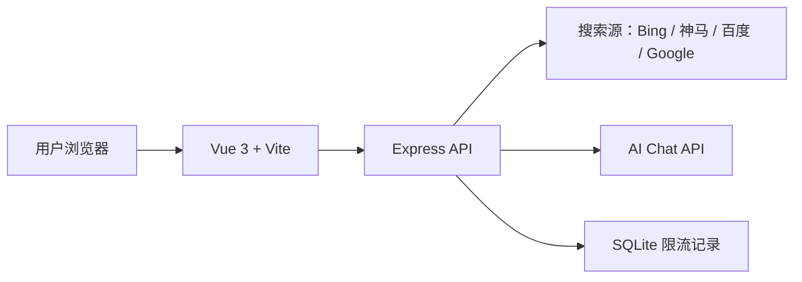

<div align="center">
  <h1>OnePercent TapTap Generator</h1>

  

  <p>
    <a href="#版本"></a>
    <a href="https://github.com/RichardLitt/standard-readme"></a>
    <a href="./LICENSE"></a>
    
    
    
  </p>

  <p>
    <strong>百分之一 TapTap 帖子生成器</strong>
    <br>
    输入游戏名，搜索公开资料，并生成符合 TapTap《我的百分之一》活动格式的推荐帖。
  </p>
</div>

## 目录

- [安全](#安全)
- [背景](#背景)
- [安装](#安装)
- [使用](#使用)
- [配置](#配置)
- [功能](#功能)
- [技术栈](#技术栈)
- [API](#api)
- [项目结构](#项目结构)
- [版本](#版本)
- [维护者](#维护者)
- [贡献](#贡献)
- [License](#license)

## 安全

- 不要提交 `.env`、API Key、代理账号或任何私密配置。
- 公开仓库只应提交 `.env.example` 一类模板文件。
- 生产环境建议使用 HTTPS，并在网关或反向代理层补充访问频率限制。
- `/api/config` 只暴露前端可展示的限流配置，不暴露 AI Key、模型地址等敏感信息。
- 当前后端已包含基础限流，但它不能替代完整的鉴权、审计和风控系统。

## 背景

TapTap《我的百分之一》活动帖通常需要固定信息结构，例如游戏名称、发售平台、游玩时间、推荐人群、个人故事和许愿卡牌。手写这类帖子容易遗漏字段，也容易在格式上不统一。

本项目的目标是保留玩家输入的真实信息，让 AI 只负责资料整理和表达生成。最终文章中的“游戏名称”始终使用用户输入值，不由 AI 改写。

## 安装

### 依赖

| 依赖 | 建议版本 | 说明 |
| --- | --- | --- |
| Node.js | 18+ | 前后端运行环境 |
| npm | 9+ | 依赖安装和脚本执行 |
| Docker | 可选 | 容器部署 |
| Docker Compose | 可选 | 一键启动前后端服务 |

### 本地安装

```bash
git clone git@github.com:littleseven2003/onepercent_taptap_generator.git
cd onepercent_taptap_generator

cd server
npm install

cd ../web
npm install
```

## 使用

### 本地开发

先配置后端环境变量：

```bash
cp .env.example .env
```

启动后端：

```bash
cd server
npm run dev
```

启动前端：

```bash
cd web
npm run dev
```

默认访问地址：

| 服务 | 地址 |
| --- | --- |
| 前端 | `http://localhost:5173` |
| 后端 | `http://localhost:3000` |

### Docker 部署

```bash
docker compose up -d
```

默认访问地址：

| 服务 | 地址 |
| --- | --- |
| Web | `http://localhost:8080` |
| API | `http://localhost:3000` |

### 推荐流程

1. 输入游戏名称。
2. 按需展开“手动补充信息”，填写游玩时间、推荐人群或个人故事。
3. 点击生成帖子。
4. 查看搜索状态和生成结果。
5. 一键复制全文到 TapTap。

## 配置

| 变量 | 说明 | 默认值 |
| --- | --- | --- |
| `PORT` | 后端端口 | `3000` |
| `AI_API_BASE_URL` | AI API 地址 | - |
| `AI_API_KEY` | AI API Key | - |
| `AI_MODEL` | 模型名称 | `gpt-3.5-turbo` |
| `SEARCH_ENABLED` | 是否启用联网搜索 | `true` |
| `SEARCH_PROVIDER` | 搜索源：`auto` / `bing` / `sm` / `baidu` / `google` / `none` | `auto` |
| `SEARCH_TIMEOUT_MS` | 单个搜索源超时时间，单位毫秒 | `8000` |
| `SEARCH_USE_PROXY` | 搜索请求是否使用系统代理变量 | `false` |
| `RATE_LIMIT_WINDOW_MINUTES` | 限流窗口，单位分钟 | `10` |
| `RATE_LIMIT_MAX_REQUESTS` | 窗口内最大请求次数 | `3` |
| `RATE_LIMIT_DAILY_MAX` | 每日最大请求次数 | `20` |

未配置 `AI_API_KEY` 时，后端会使用 mock 模式返回示例内容，便于本地调试页面流程。

搜索默认使用 `auto` 模式，会按 Bing -> 神马 -> 百度 顺序尝试。国内网络环境建议保留 `auto`，或设置为 `bing`、`sm`、`baidu`。如需完全关闭联网搜索：

```bash
SEARCH_ENABLED=false
# 或
SEARCH_PROVIDER=none
```

默认搜索请求会忽略系统 `HTTP_PROXY` / `HTTPS_PROXY`，避免本机代理端口未启动时导致搜索失败。确实需要走代理时：

```bash
SEARCH_USE_PROXY=true
```

## 功能

| 功能 | 说明 |
| --- | --- |
| 活动格式生成 | 生成 TapTap《我的百分之一》活动格式帖子 |
| 用户输入优先 | 最终文章中的游戏名称固定使用用户输入值 |
| 联网搜索 | 可搜索公开资料，并展示搜索成功、失败、超时和无结果状态 |
| 手动补充 | 支持发售平台、游玩时间、推荐人群、个人故事和许愿卡牌 |
| 一键复制 | 快速复制生成结果 |
| 主题系统 | 支持亮色 / 暗色模式和多套主题配色 |
| 使用限制展示 | 页面底部展示版本、限流说明、GitHub 仓库和 GPL 协议 |
| 响应式界面 | 适配桌面端和移动端 |

## 技术栈



| 模块 | 技术 |
| --- | --- |
| 前端 | Vue 3、Vite、Axios |
| 后端 | Node.js、Express、Axios |
| 数据 | SQLite，用于限流记录 |
| 部署 | Docker、Docker Compose、Nginx |

## API

### `GET /api/health`

健康检查接口。

```bash
curl http://localhost:3000/api/health
```

### `GET /api/config`

公开运行配置接口。当前只返回前端可展示的限流配置，不返回 AI Key、模型地址等敏感信息。

```bash
curl http://localhost:3000/api/config
```

响应示例：

```json
{
  "code": 200,
  "data": {
    "rateLimit": {
      "enabled": true,
      "windowMinutes": 10,
      "windowMaxRequests": 3,
      "dailyMaxRequests": 20
    }
  }
}
```

### `POST /api/generate`

生成帖子接口。

```bash
curl -X POST http://localhost:3000/api/generate \
  -H "Content-Type: application/json" \
  -d '{
    "gameName": "星露谷物语",
    "playTime": "80小时",
    "targetAudience": "喜欢种田、经营和慢节奏探索的玩家"
  }'
```

常用请求字段：

| 字段 | 说明 | 必填 |
| --- | --- | --- |
| `gameName` | 游戏名称 | 是 |
| `releasePlatform` | 发售平台 | 否 |
| `playTime` | 游玩时间 | 否 |
| `targetAudience` | 推荐人群 | 否 |
| `personalStory` | 个人故事或推荐理由 | 否 |
| `wishCard` | 许愿卡牌 | 否 |

## 项目结构

```text
.
├── docker-compose.yml
├── docs/
│   ├── assets/
│   │   └── logo.svg
│   └── design.md
├── server/
│   ├── src/
│   │   ├── routes/
│   │   ├── services/
│   │   └── app.js
│   └── package.json
├── web/
│   ├── src/
│   │   ├── components/
│   │   ├── styles/
│   │   └── App.vue
│   └── package.json
└── README.md
```

## 版本

当前稳定版本：`v1.0.0`

版本号约定：

- Git 标签使用 `vX.Y.Z`，例如 `v1.0.0`。
- 前端和后端 `package.json` 使用 npm 语义化版本格式，例如 `1.0.0`。
- 重要功能完成后按 `docs/design.md` 中的提交规范及时提交并同步远程。

## 维护者

- [@littleseven2003](https://github.com/littleseven2003)

## 贡献

欢迎通过 GitHub Issues 反馈问题或提出改进建议，也欢迎提交 Pull Request。

提交信息请使用项目约定格式：

```text
类型:中文描述
```

常用类型包括 `feature`、`fix`、`docs`、`style`、`refactor`、`config`、`deploy`、`chore`。

README 结构参考 [standard-readme](https://github.com/RichardLitt/standard-readme)，保持标题、目录、安装、使用、贡献和 License 等核心章节可快速定位。

## License

[GPL-3.0](./LICENSE) © littleseven2003
